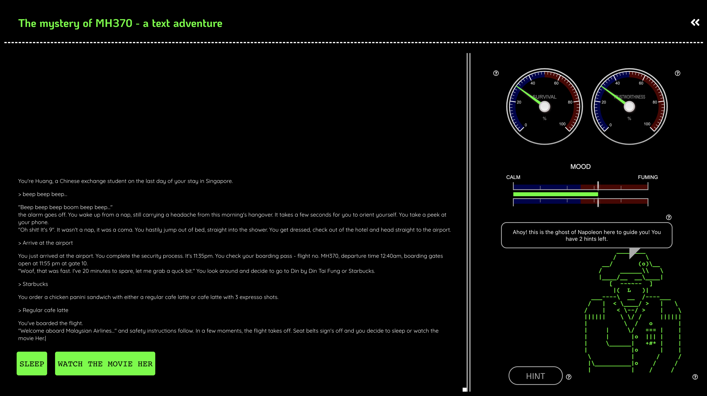

# text-adventure

<!-- PROJECT SHIELDS -->
<!--
*** I'm using markdown "reference style" links for readability.
*** Reference links are enclosed in brackets [ ] instead of parentheses ( ).
*** See the bottom of this document for the declaration of the reference variables
*** for contributors-url, forks-url, etc. This is an optional, concise syntax you may use.
*** https://www.markdownguide.org/basic-syntax/#reference-style-links
-->

<!-- [![Contributors][contributors-shield]][contributors-url]
[![Forks][forks-shield]][forks-url]
[![Stargazers][stars-shield]][stars-url]
[![Issues][issues-shield]][issues-url]
[![MIT License][license-shield]][license-url]
[![LinkedIn][linkedin-shield]][linkedin-url] -->

<!-- PROJECT LOGO -->
 

  

  <h3 align="center">The mystery of MH370 - a text adventure</h3>

  

    A gripping 'choose-your-own-adventure' game with an AI assistant
     
    <a href="https://mh370-text-adventure.netlify.app">View Demo</a>
    ·
    <a href="https://github.com/aroralanuk/text-adventure/issues">Report Bug</a>
    ·
    <a href="https://github.com/aroralanuk/text-adventure/issues">Request Feature</a>
  

<!-- TABLE OF CONTENTS -->

  
Table of Contents

  <ol>
    <li>
      <a href="#about-the-project">About The Project</a>
      <ul>
        <li><a href="#built-with">Built With</a></li>
      </ul>
    </li>
    <li>
      <a href="#getting-started">Getting Started</a>
      <ul>
        <li><a href="#prerequisites">Prerequisites</a></li>
        <li><a href="#installation">Installation</a></li>
      </ul>
    </li>
    <li><a href="#usage">Usage</a></li>
    <li><a href="#roadmap">Roadmap</a></li>
    <li><a href="#contact">Contact</a></li>
    <li><a href="#acknowledgements">Acknowledgements</a></li> 
  </ol>

<!-- ABOUT THE PROJECT -->

## About The Project

As a person who just got started with gaming recently, I've struggled with the steep learning curve in quite a few games. Tutorials are a great starting point but usually prove to be inadequate for assisting gamers during gameplay. Our solution is to make an intelligent agent which learns from past successful playthroughs and guides you whenever you're stuck. We chose a 'choose your own adventure' format as it's the simplest variation and interface to tackle without compromising the storyline or the degree of guidance to the user. While providing you recommendations, we also display additional metrics to set reasonable expectations for the AI agent. This app is built as a final project for [CSE 190: Human-AI Interactions](https://kristenvaccaro.github.io/human-ai/) class under Professor Kristen Vaccaro.

Prominent features of the game:

- a 'choose your own adventure' (CYOA) game loosely based on the infamous flight [MH370](https://en.wikipedia.org/wiki/Malaysia_Airlines_Flight_370) which mysteriously disappear in the Indian Ocean. We store the binary choices made as `0`,`1` or `-1` as left, right, or not made yet for every fork.
- an AI agent in the form of the 'ghost of napoleon' avatar built using random decision forest trained on a vector representation of various choices made in the direct acyclic graph which forms the storyline, for eg., `[0,-1,1,0,1,-1,-1]`. The hints given are the output of the [sentence similarity model](https://medium.com/spark-nlp/easy-sentence-similarity-with-bert-sentence-embeddings-using-john-snow-labs-nlu-ea078deb6ebf) trained on a dataset of [movie lines](https://www.kaggle.com/Cornell-University/movie-dialog-corpus) using BERT, Electra, and Universal Sentence Encoder Embeddings simultaneously.
- metrics accompanying each recommendation from the ghost like your chance of survival currently as predicted by the ghost, trustworthiness placed in the ghost's hints by the users before you and the ghost's current mood which impacts his sincerity in providing you the proper hints.

Using the above hints given by the ghost and the information from the survival, trusworthiness, and mood gauges, you use your judgement and pick the best option at each step to survive the flight.

NB - every time you start the live demo, it'll take a little while to retrain the model and then load the game. After that, the game will run seamlessly even on restarting it.

### Built With

- [Jupyter Notebook](https://jupyter.org/)
- [Flask](https://flask.palletsprojects.com/en/2.0.x/)
- [React](https://reactjs.org/)

<!-- GETTING STARTED -->

## Getting Started

To get a local copy up and running follow these simple example steps.

### Prerequisites

1. Python 3 and pip - [instructions](https://www.python.org/downloads/)
2. pipenv - [instructions](https://pypi.org/project/pipenv/)
3. Node and npm - [instructions](https://nodejs.org/en/)

### Installation

Both the server and the client directories has their own README, make sure to read those to get acquainted with the code and set it up locally.

<!-- USAGE EXAMPLES -->

## Usage

This is what the game interface looks like:

The left section of the screen has the main game interface where you can select your preferred choice. The storyline so far with all your previous choices are also displayed here.

On the right, the magic happens. The ghost of Napoleon character which is based on an machine learning algorithm trained on past playthroughs can give you maximum three cryptic clues to guide you on your quest. These hints can only be exhausted if you've more than one choice to select from at the current scene.

The top two dials along with the slider give more information about the hints. On the top-left is the "Survival %" gauge which gives your chance of survival at the current stage. On the top-right is the "Trustworthiness %" gauge which presents you the ratio of people who agreed with the hint given by the ghost at this stage. The "Mood" slider displays the current mood of the ghost determined by your adherence to his hints. As his mood worsens and moves towards "Fuming", he's more likely to give you deceiving hints.

While playing the game, your objective is to strategically use the hints from the ghosts, decipher them and based on the trustworthiness and mood, judge if you want to go along with them. If the mood is calm and the trustworthiness is high or vice versa, it's a no-brainer, but either if the mood is fuming or the trustworthiness is low, you should be critical about his intentions or credibility.

<!-- ROADMAP -->

## Roadmap

See the [open issues](https://github.com/aroralanuk/text-adventure/issues) for a list of proposed features (and known issues).

If I find ample time, I'm planning to make "Text Adventure 2.0" with the following features:

- Loops and multigraphs allowed in the story graph
- Richer and longer storyline with multiple characters and ability to pick up items for inventory
- typing your choices out like "head north" instead of providing limited pre-defined choices
- using a more complicated ML algorithm instead of the random forest classfier to handle the above two features
- providing more contextualized clues based on previous attempts or previous adherence with clues
- more responsive and faster front-end

<!-- CONTACT -->

## Contact

Kunal Arora - [@arorAlanuK](https://twitter.com/arorAlanuK) - crazentonkunalizar@gmail.com

McKinley Souder - msouder@ucsd.edu

<!-- ACKNOWLEDGEMENTS -->

## Acknowledgements

- [ASCII art](https://www.asciiart.eu/)
- [Sentence similarity model](https://medium.com/spark-nlp/easy-sentence-similarity-with-bert-sentence-embeddings-using-john-snow-labs-nlu-ea078deb6ebf)

<!-- MARKDOWN LINKS & IMAGES -->
<!-- https://www.markdownguide.org/basic-syntax/#reference-style-links -->

[contributors-shield]: https://img.shields.io/github/contributors/othneildrew/Best-README-Template.svg?style=for-the-badge
[contributors-url]: https://github.com/aroralanuk/text-adventure/graphs/contributors
[forks-shield]: https://img.shields.io/github/forks/othneildrew/Best-README-Template.svg?style=for-the-badge
[forks-url]: https://github.com/aroralanuk/text-adventure/network/members
[stars-shield]: https://img.shields.io/github/stars/othneildrew/Best-README-Template.svg?style=for-the-badge
[stars-url]: https://github.com/aroralanuk/text-adventure/stargazers
[issues-shield]: https://img.shields.io/github/issues/othneildrew/Best-README-Template.svg?style=for-the-badge
[issues-url]: https://github.com/aroralanuk/text-adventure/issues
[license-shield]: https://img.shields.io/github/license/othneildrew/Best-README-Template.svg?style=for-the-badge
[license-url]: https://github.com/othneildrew/Best-README-Template/blob/master/LICENSE.txt
[linkedin-shield]: https://img.shields.io/badge/-LinkedIn-black.svg?style=for-the-badge&logo=linkedin&colorB=555
[linkedin-url]: https://linkedin.com/in/othneildrew
[product-screenshot]: images/screenshot.png
